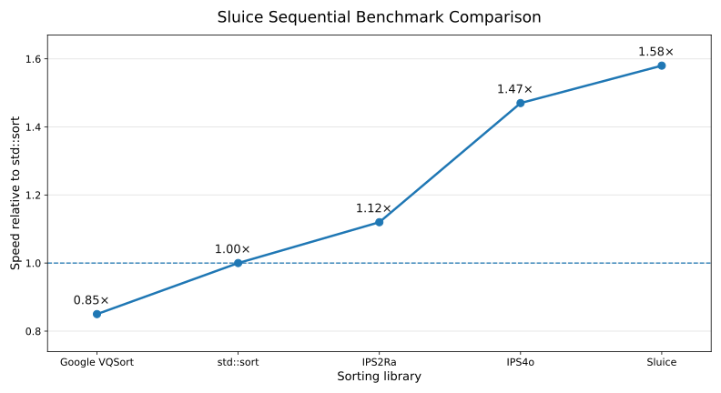

# Sluice

**An adaptive numeric sorting engine that routes every dataset through its
fastest available sorting strategy.**

*Version 0.9.8 pre-1.0*

Just as a sluice channels a mixed stream and separates it into graded outputs by
routing it through the right screen, this engine inspects the input and
**dispatches to the fastest applicable method** — so it is never meaningfully
slower than `std::sort` and often several times faster. It sorts 32- and 64-bit
integers (signed or unsigned) and `float`/`double`.

```
tiny arrays (n < 16)       -> insertion sort       (no setup cost)
small arrays (n <= 512)    -> interpolation place   (Flashsort; skew-guarded)
already sorted             -> return early          (detected in the scan pass)
bounded range (<= 4n)      -> counting sort         (O(n), no comparisons)
everything else            -> LSD radix sort         (O(n·w), beats std::sort)
allocation failure         -> std::sort             (in-place safety net)
```

Non-comparison methods (interpolation, counting, radix) sidestep the
Ω(n·log n) lower bound that binds every comparison sort, which is why they win
on fixed-width numeric keys — integers directly, and `float`/`double` via an
order-preserving IEEE-754 transform that maps them to sortable unsigned keys.
The interpolation path (Flashsort, Neubert 1998 — see
[References](#references)) computes each element's approximate position
directly and repairs locally; its O(n²) worst case is defused by
capping it to n <= 512 plus a skew guard that hands off to radix the moment
any bucket grows too large — so the O(n²) tail can never trigger. Bucket indices
use exact integer arithmetic (128-bit intermediate where available), so there is
no floating-point division-by-zero even for adjacent 64-bit magnitudes that
collide when cast to `double`.

**Sort direction.** Ascending is the default. Every type also has an `_ordered`
entry point taking `SLUICE_ASCENDING` or `SLUICE_DESCENDING`; descending is the
ascending result reversed in place (O(n)).

## Measured vs `std::sort` (this machine, uint32)

Benchmarked over a pool of distinct arrays per size — the realistic case.
(Re-sorting one identical array instead lets the branch predictor memorise the
comparison order and flatters `std::sort`; this harness deliberately avoids
that.)

| input                    | speedup | path         |
|--------------------------|--------:|--------------|
| n=8    uniform           | ~1.0x (tie) | insertion    |
| n=50   uniform           |   2.5x  | interpolation |
| n=200  uniform           |   4.1x  | interpolation |
| n=512  uniform           |   5.1x  | interpolation |
| n=1000 uniform           |   4.9x  | radix        |
| n=100k uniform           |   7.6x  | radix        |
| n=1M   uniform           |   7.2x  | radix        |
| n=1M   bounded (<1000)   |  33.7x  | counting     |
| n=1M   already sorted    |  15.4x  | early exit   |

Reproduce with `make bench`.

### Across the full size range vs multiple methods

Sweeping n from 8 to 1,048,576 (uniform random uint32), Sluice's advantage
grows from parity at the smallest sizes to 7–12× at a million elements. The
**overall geometric-mean gain is 4.7× across the field** (3.7× vs `std::sort`,
4.5× vs `std::stable_sort`, 6.4× vs `heapsort`). At n=8 the insertion path ties
`std::sort` (introsort also uses insertion for tiny inputs) while already
beating stable_sort and heapsort.

### All seven methods (absolute time per element)


Every method plotted as its own curve (uniform random uint32, lower = faster).
Sluice tracks whichever underlying method is fastest at each size — insertion
below 16, interpolation to 512, radix above. Two honesty notes on the extra
lines:

- **insertion sort is O(n²)** — its per-element cost climbs linearly with n, so
  it's shown to n=16384 and then goes off-scale (it can't practically run at
  n=1M).
- **counting sort can't sort wide-range data** — its memory scales with the
  *value range*, not n (uniform uint32 would need ~8 GB of buckets). It's shown
  (dashed) on bounded input [0, n), its valid domain, where it's a flat O(n)
  line. On that domain Sluice dispatches to it, reaching 33.7× vs `std::sort`.

Note radix's high cost at tiny n (its per-call heap allocation dominates) — the
exact reason Sluice uses interpolation, not radix, below n=512.

**Sluice vs radix.** Past n=512 Sluice *is* radix internally, so its line tracks
the radix line closely: faster below 512 (interpolation, and radix's small-n
allocation cost), then within a few percent above radix from ~1024 up. That
small gap is the one extra min/max/"already sorted?" scan pass the dispatcher
runs before choosing a path — the price of being adaptive, and exactly what lets
Sluice shortcut to the counting/early-exit paths that win big on sorted or
bounded data. (All seven curves here are built with the *same* flags — the
library's default portable `-O3` — so the comparison is apples-to-apples; an
earlier version of this chart accidentally compiled the reference radix with
`-march=native` and the library without, which exaggerated the gap.)

### Against other state-of-the-art sorting libraries

The comparison and textbook sorts above are the obvious baselines; the harder
test is against modern high-performance sorting libraries. Run single-threaded
and normalised to `std::sort` (= 1.0×, higher is faster), Sluice leads the field
on this workload:



| library       | speed vs `std::sort` | approach                                          |
|---------------|---------------------:|---------------------------------------------------|
| **Sluice**    | **1.58×**            | adaptive dispatch (this project)                  |
| IPS4o         | 1.47×                | in-place parallel super-scalar samplesort (sequential mode) |
| IPS2Ra        | 1.12×                | in-place parallel super-scalar radix sort (sequential mode) |
| `std::sort`   | 1.00×                | libstdc++ introsort (baseline)                    |
| Google VQSort | 0.85×                | Highway SIMD vectorised quicksort                 |

IPS4o and IPS2Ra (Axtmann et al.) and Google's VQSort are heavily engineered for
raw throughput; Sluice's edge here comes from routing fixed-width numeric keys to
non-comparison methods (radix/counting) that sidestep the Ω(n·log n) barrier the
vectorised comparison engines still pay. Two honest caveats: these are
**single-threaded** numbers — Sluice also has an opt-in parallel radix path
(`max_threads`, see [Parallel sorting](#parallel-sorting)) for large arrays, while
IPS4o and IPS2Ra are built primarily to scale across many cores, so a
multi-threaded comparison would look different — and, like every figure here, they
reflect one workload on one machine (see [Scope & caveats](#scope--caveats)).

### Interpolation vs radix in the n ≤ 512 band

The small-array band dispatches to interpolation rather than radix (the general-
purpose path). This is why — interpolation's gain over radix across that band,
uniform random uint32:

| n   | interpolation | radix   | interp gain |
|-----|--------------:|--------:|------------:|
| 16  |       145 ns  |  606 ns |    4.18x    |
| 32  |       270 ns  |  637 ns |    2.36x    |
| 64  |       464 ns  |  818 ns |    1.76x    |
| 128 |       871 ns  | 1215 ns |    1.40x    |
| 256 |      1655 ns  | 1967 ns |    1.19x    |
| 384 |      2474 ns  | 2732 ns |    1.10x    |
| 512 |      3279 ns  | 3516 ns |    1.07x    |

**Geomean gain over radix in this band: 1.66x.** The advantage is largest at
tiny n, where radix pays a per-call heap allocation for its ping-pong buffer
while interpolation runs entirely on the stack; it narrows toward the ~768
crossover, beyond which radix wins and the dispatcher switches to it.

## Scope & caveats

- **Fixed-width numeric keys:** `uint32/int32/uint64/int64`, plus `float` and
  `double`. Radix needs fixed-width decomposable keys; this is the deliberate
  trade — specialization for speed. `std::sort` remains the right tool for
  arbitrary comparables.
- Signed integers map to the unsigned domain by flipping the sign bit; floats
  map to order-preserving unsigned keys via the IEEE-754 transform (memcpy for
  bit access, so no aliasing violation). Float ordering is a total order
  (-inf < -0 < +0 < +inf, NaNs by bit pattern) — well-defined even for NaN,
  unlike `std::sort`.
- Uses ~n auxiliary memory (radix, and the float key buffer) or O(range)
  (counting); `std::sort` is in-place and is the fallback on allocation failure.
- Equal keys are indistinguishable, so results are stable by construction.
- Not novel research: this is a well-engineered combination of established
  algorithms, dispatched adaptively — the same family as `boost::spreadsort`
  and `ska_sort`. The interpolation path is **Flashsort** (Neubert, 1998); the
  bounded path is **counting sort** (Seward, 1954); the general path is **LSD
  radix sort** (Hollerith-era). See [References](#references).

## References

The named algorithms Sluice dispatches to, and their sources:

- **Interpolation path — Flashsort.** Karl-Dietrich Neubert, "The Flashsort1
  Algorithm", *Dr. Dobb's Journal* 23(2): 123–125, 131 (February 1998). An
  in-place implementation of histogram sort (a type of bucket sort) that
  classifies each element to a bucket by linear interpolation over [min, max],
  then repairs with insertion sort — exactly the interpolation path used here.
  <https://en.wikipedia.org/wiki/Flashsort>
- **Bounded path — counting sort.** Harold H. Seward, 1954.
- **General path — LSD radix sort.** Origins in Hollerith's tabulating
  machines (1880s); see D. E. Knuth, *TAOCP* Vol. 3, "Sorting and Searching".
- **Modern descendant (context).** Kristo et al., "The Case for a Learned
  Sorting Algorithm" (SIGMOD 2020) — replaces the linear interpolation with a
  learned model of the data distribution; same core idea as Flashsort.

The Sluice engine itself — the adaptive dispatcher, the skew guard, the
cross-platform build, and the benchmarks — is original work built on top of
these published methods.

## Build

Native (autodetects Linux / macOS / Windows host):

```
make            # static lib + shared lib + CLI executable
make test       # run the correctness self-test
make bench      # run the benchmark
make sanitize   # build with ASan+UBSan (incl. float-cast-overflow), run self-test
make strict     # compile library + CLI + C++ header, warnings-as-errors
make alloc-test # verify graceful degradation under allocation failure
```

The self-test fuzzes against `std::sort` across every type (u32/i32/u64/i64,
`float`, `double`), every dispatch boundary (15/16/17, 31/32/33, 511/512/513,
999/1000/1001, 100k, 1M), six input shapes (random, bounded, duplicate-heavy,
nearly-sorted, reverse-sorted, all-equal), adversarial 64-bit magnitudes (near
2⁵³/2⁶³/UINT64_MAX, INT64_MIN/MAX), NaN handling, the first/top selectors, the
unified dispatcher and its stats, custom configs, and the parallel path. It is
clean under ASan+UBSan, ThreadSanitizer, and the strict warning set.

Artifacts land in `build/<target>/`:

| file                     | what                          |
|--------------------------|-------------------------------|
| `libsluice.a`            | static library                |
| `libsluice.so`           | shared library (Linux)        |
| `libsluice.dylib`        | shared library (macOS)        |
| `libsluice.dll` + `.dll.a` | shared library + import lib (Windows) |
| `sluice` / `sluice.exe`  | command-line executable       |

### Cross-compiling

Pick a target and provide the matching toolchain:

```
make TARGET=windows        # needs MinGW-w64  (x86_64-w64-mingw32-g++)
make TARGET=macos          # needs osxcross   (o64-clang++)
make TARGET=linux          # needs g++/clang++
make all-targets           # builds each target you have a toolchain for
```

One-host option — `zig` bundles the libc/SDKs for every target, so a single
install cross-compiles all three:

```
make USE_ZIG=1 TARGET=windows
make USE_ZIG=1 TARGET=macos
make USE_ZIG=1 TARGET=linux
```

You can always force the compiler explicitly: `make TARGET=windows CXX=/path/to/cc`.

> Build note: the Linux artifacts in this drop were compiled and tested with
> g++ 13. The Windows and macOS targets are wired up in the Makefile and report
> the correct cross-compiler, but were not built here (no cross-toolchain in the
> build sandbox). Install MinGW-w64 / osxcross, or use `USE_ZIG=1`, to produce
> those binaries.

### Building on ARM

The engine is architecture-neutral C++17 — no inline assembly, no x86
intrinsics, no pointer-size or packing assumptions — so g++ (or clang++)
compiles it on ARM the same as on x86. The Makefile carries **no `-march`
flag**, so it is not tied to any architecture: nothing special is needed to
target ARM.

Natively on an ARM machine (Raspberry Pi, AWS Graviton, Apple Silicon under
Linux, etc.): just `make` / `make test`.

Cross-compiling from an x86 host — only the compiler changes; the Makefile
honours a user-set `CXX`:

```
make CXX=aarch64-linux-gnu-g++        # 64-bit ARM (AArch64)
make CXX=arm-linux-gnueabihf-g++      # 32-bit ARM
make USE_ZIG=1 CXX="zig c++ -target aarch64-linux-gnu"
```

Optional CPU tuning (defaults to portable `-O3`): append flags via `CXXFLAGS`,
e.g. `make CXXFLAGS="-march=native"` or `make CXX=aarch64-linux-gnu-g++
CXXFLAGS="-march=armv8-a"`. On mainstream 64-bit ARM, `uint64_t` and `double`
are hardware-native (full speed); on an FPU-less 32-bit microcontroller the
interpolation path's `double` math is software-emulated (correct, slower).
ARM builds were not compiled in the dev sandbox (x86-only), so run `make test`
on your ARM target to confirm.

## Command-line tool

```
sluice                       self-test, then benchmark
sluice --test                correctness self-test only (exit 1 on failure)
sluice --bench               benchmark only
sluice --version             print version
sluice [--asc|--desc] [--first K | --top K] n1 n2 n3 ...
                             sort the integers and print them
```

Direction and selection are independent flags that may appear in any order — no
`--sort` keyword is required. `--asc` (default) / `--desc` set the sort
direction. With no selector the whole sorted array prints; `--first K` keeps the
first K of the sorted result (its head), `--top K` keeps the last K (its tail).
Non-integer arguments are skipped with a warning; an empty list prints usage;
`K > n` returns everything and `K = 0` prints nothing.

(The CLI parses integer arguments only; `float`/`double` sorting is available
through the library API — see below.)

```
$ sluice 1 6 4 9 2               # sort ascending (default)
1 2 4 6 9

$ sluice --desc 1 6 4 9 2        # sort descending
9 6 4 2 1

$ sluice --first 3 1 6 4 9 2     # head of ascending = 3 smallest
1 2 4

$ sluice --desc --first 3 1 6 4 9 2   # head of descending = 3 largest
9 6 4

$ sluice --top 3 1 6 4 9 2       # tail of ascending = 3 largest, ascending
4 6 9

$ sluice --desc --top 3 1 6 4 9 2     # tail of descending
4 2 1
```

## Using the library

C / C++:

```c
#include "sluice.h"
uint32_t data[] = { 9, 1, 8, 2, 7 };
sluice_sort_u32(data, 5);                              // ascending -> 1 2 7 8 9
sluice_sort_u32_ordered(data, 5, SLUICE_DESCENDING);   // -> 9 8 7 2 1

double vals[] = { 3.14, -2.5, 0.0, -1.0, 2.71 };
sluice_sort_f64(vals, 5);                              // -> -2.5 -1 0 2.71 3.14
```

Link statically: `cc app.c libsluice.a -lstdc++`
Link dynamically: `cc app.c -DSLUICE_USE_SHARED -lsluice`

From Python via the shared library (no build step needed):

```python
import ctypes
lib = ctypes.CDLL("./build/linux/libsluice.so")
arr = (ctypes.c_uint32 * 5)(9, 1, 8, 2, 7)
lib.sluice_sort_u32_ordered(arr, 5, 1)   # 1 = SLUICE_DESCENDING
print(list(arr))                          # [9, 8, 7, 2, 1]
```

### C++ wrapper (`sluice.hpp`)

Header-only, type-safe, size-deduced. Element type and length come from the
container; each call dispatches at compile time to the matching specialized C
function, so there's no runtime type switch and no overhead over the C ABI.
Unsupported element types are a compile error, not a runtime check.

```cpp
#include "sluice.hpp"
std::vector<double> v = { 3.14, -2.5, 0.0, -1.0, 2.71 };

// sort — ascending by default, or pass a direction
sluice::sort(v);                          // ascending
sluice::sort(v, SLUICE_DESCENDING);
sluice::ascending(v);                     // explicit shorthands
sluice::descending(v);

// selection — first N (head) / top N (tail); direction optional
sluice::first(v, 20);                     // 20 smallest, moved to the front
sluice::top(v, 20);                       // 20 largest, moved to the front
sluice::first(v, 20, SLUICE_DESCENDING);  // direction picks which end
sluice::top(v, 20, SLUICE_DESCENDING);

// every verb also has a raw pointer + size overload
sluice::sort(v.data(), v.size());
sluice::ascending(v.data(), v.size());
sluice::first(v.data(), v.size(), 20);
sluice::top(v.data(), v.size(), 20);

// profiling and custom tuning (route through the unified dispatcher)
sluice_stats  st;    sluice::sort(v, st);        // fill stats
sluice_config cfg{}; sluice::sort(v, cfg);       // custom thresholds
sluice::sort(v, cfg, st);                        // both
```

`first`/`top` return the count kept (`min(k, n)`); the `stats`/`cfg` forms of
`sort` return a `sluice_status`. A trailing `sluice_order` argument is accepted
on all of them (e.g. `sluice::sort(v, st, SLUICE_DESCENDING)`). The `stats`/`cfg`
overloads currently exist on `sort` only — `ascending`/`descending`/`first`/`top`
are plain convenience forms.

### One call over any type + profiling

The C ABI also exposes a single dispatcher over all six types. `select > 0`
keeps the first N, `< 0` the top |N|, `0` sorts all; `order` may be `NULL`
(ascending). With `collect_stats = 0` it routes straight to the fast specialized
path; with `1` it fills a `sluice_stats` (algorithm chosen, wall time, auxiliary
memory, radix passes, already-sorted, duplicate %, value range).

```c
sluice_stats st;
sluice_sort(SLUICE_U32, data, n, /*select=*/0, /*order=*/NULL, /*collect_stats=*/1, &st, /*cfg=*/NULL);
// st.algorithm -> "counting", st.duplicate_pct -> 99.0, st.range -> 999, ...
```

The specialized `sluice_sort_*` / `sluice_first_n_*` / `sluice_top_n_*` functions
remain the fastest route and are unchanged; the dispatcher is a convenience over
them (with optional profiling that the fast path never pays for).

### Custom dispatch tuning

The dispatch thresholds are CPU-dependent — the best interpolation cutoff or
counting-sort load factor differs across machines. Pass a `sluice_config` to
override any of them; a field left `0` keeps its default, or call
`sluice_config_init` to fill defaults and tweak from there.

```c
sluice_config cfg = {0};        /* all defaults */
cfg.interpolation_limit = 768;  /* interpolate for larger arrays on this CPU */
cfg.counting_load       = 8;    /* accept counting sort over a wider range   */
sluice_sort(SLUICE_U32, data, n, 0, NULL, 0, NULL, &cfg);
```
```cpp
sluice::sort(v, cfg);           // C++ wrapper; sluice::sort(v, cfg, stats) too
```

Fields: `insertion_limit`, `interpolation_limit`, `interpolation_skew`,
`counting_load`, `counting_cap`, plus the parallel knobs below. Supplying a
config routes through the general engine rather than the in-place specialized
path (a small cost), so it's for tuning and profiling, not the hot path.
`interpolation_limit` is clamped to an internal ceiling (4096); values above the
default 512 use heap scratch instead of the stack.

### Parallel sorting

On large arrays the radix path can be split across cores. Set `max_threads` to
opt in; `0` or `1` means sequential (the default), so nothing runs on threads
unless you ask. Parallelism only engages when the sort actually reaches the
radix path *and* `n >= parallel_min` (default 262144).

```c
sluice_config cfg = {0};
cfg.max_threads  = 8;        /* use up to 8 worker threads    */
cfg.parallel_min = 500000;   /* ...but only for n >= 500k      */
sluice_sort(SLUICE_U32, data, n, 0, NULL, 1, &stats, &cfg);
/* stats.threads_used reports how many were used */
```

The scheme is a most-significant-digit split: one pass partitions by the top
byte into 256 independent buckets (concatenated in order they're already
globally sorted — no merge step), then worker threads finish each bucket on its
lower bytes, pulling buckets from a shared atomic counter for load balancing.
The result is **identical** to the sequential sort. It's verified equal to
`std::sort` across thread counts and skewed distributions, and the path is clean
under ThreadSanitizer.

> Speedup depends on core count and memory bandwidth; integer sorting
> parallelizes well but is partly bandwidth-bound, so expect meaningful gains at
> large n on many-core machines rather than perfect linear scaling.

## API

```c
typedef enum { SLUICE_ASCENDING = 0, SLUICE_DESCENDING = 1 } sluice_order;

/* ascending shorthands */
void        sluice_sort_u32(uint32_t* data, size_t n);
void        sluice_sort_i32(int32_t*  data, size_t n);
void        sluice_sort_u64(uint64_t* data, size_t n);
void        sluice_sort_i64(int64_t*  data, size_t n);
void        sluice_sort_f32(float*  data, size_t n);
void        sluice_sort_f64(double* data, size_t n);

/* direction-aware forms */
void        sluice_sort_u32_ordered(uint32_t* data, size_t n, sluice_order order);
void        sluice_sort_i32_ordered(int32_t*  data, size_t n, sluice_order order);
void        sluice_sort_u64_ordered(uint64_t* data, size_t n, sluice_order order);
void        sluice_sort_i64_ordered(int64_t*  data, size_t n, sluice_order order);
void        sluice_sort_f32_ordered(float*  data, size_t n, sluice_order order);
void        sluice_sort_f64_ordered(double* data, size_t n, sluice_order order);

/* head/tail of the array sorted in `order`: first_n keeps the first k, top_n
   keeps the last k (moved to the front). Return min(k, n). */
size_t      sluice_first_n_u32(uint32_t* data, size_t n, size_t k, sluice_order order);
size_t      sluice_first_n_i32(int32_t*  data, size_t n, size_t k, sluice_order order);
size_t      sluice_first_n_u64(uint64_t* data, size_t n, size_t k, sluice_order order);
size_t      sluice_first_n_i64(int64_t*  data, size_t n, size_t k, sluice_order order);
size_t      sluice_top_n_u32(uint32_t* data, size_t n, size_t k, sluice_order order);
size_t      sluice_top_n_i32(int32_t*  data, size_t n, size_t k, sluice_order order);
size_t      sluice_top_n_u64(uint64_t* data, size_t n, size_t k, sluice_order order);
size_t      sluice_top_n_i64(int64_t*  data, size_t n, size_t k, sluice_order order);
/* first_n / top_n exist for f32 and f64 too, same shape. */

/* unified dispatcher over all six types, with optional profiling */
typedef enum { SLUICE_U32, SLUICE_I32, SLUICE_U64, SLUICE_I64, SLUICE_F32, SLUICE_F64 } sluice_dtype;
typedef enum { SLUICE_OK = 0, SLUICE_ERR_TYPE = -1, SLUICE_ERR_NULL = -2 } sluice_status;
typedef struct {
    const char* algorithm;      /* path taken */
    double      time_ms;
    size_t      memory_bytes;   /* auxiliary heap the chosen path used */
    int         passes;         /* radix passes (else 0) */
    int         already_sorted;
    double      duplicate_pct;  /* 100 * (1 - distinct/n) */
    double      range;          /* span of the sorted key domain */
    size_t      n;
    int         threads_used;   /* worker threads used (1 = sequential) */
} sluice_stats;
/* select: >0 first N, <0 top |N|, 0 all.  order: NULL = ascending.
   collect_stats: 0 = fast path, 1 = fill stats (must be non-NULL).
   cfg: NULL = default thresholds, else custom dispatch tuning. */
typedef struct {
    size_t   insertion_limit;      /* n < this -> insertion       (default 16)      */
    size_t   interpolation_limit;  /* n <= this -> interpolation  (default 512)     */
    int      interpolation_skew;   /* interp skew bail            (default 32)      */
    uint64_t counting_load;        /* counting if range <= load*n (default 4)       */
    uint64_t counting_cap;         /* ...and range < cap          (default 2097152) */
    int      max_threads;          /* parallel radix; 0/1 = sequential (default)    */
    size_t   parallel_min;         /* parallelize only when n >= this (default 262144) */
} sluice_config;
void          sluice_config_init(sluice_config* cfg);
sluice_status sluice_sort(sluice_dtype type, void* data, size_t n, ptrdiff_t select,
                          const sluice_order* order, int collect_stats,
                          sluice_stats* stats, const sluice_config* cfg);

int         sluice_is_sorted_u32(const uint32_t* data, size_t n);
const char* sluice_version(void);
```

## Compatibility & guarantees

**Thread safety.** Every function is reentrant and holds no shared mutable
state — no globals, no statics, no hidden caches. Concurrent calls are safe as
long as they touch non-overlapping arrays (two threads writing the same buffer
is a data race, exactly as with `memcpy`). `sluice_version()` returns a static
string literal, safe to share. Setting `max_threads > 1` lets a *single* call
use an internal pool for large radix sorts; that parallelism stays inside the
call and doesn't weaken the reentrancy guarantee. The self-test runs clean under
ThreadSanitizer.

**Allocation failure.** The engine never aborts or leaks when memory runs out.
Every heap-using path allocates inside a guard; on `std::bad_alloc` it retreats
to the next cheaper path and, ultimately, to an in-place `std::sort` over the
order-preserving key — which needs no heap and keeps a correct total order for
every domain, including IEEE-754 NaNs. The array is always left fully sorted, no
exception crosses the C ABI boundary, and `sluice_sort()` still returns
`SLUICE_OK` (reporting `algorithm == "std::sort"`, `memory_bytes == 0` when the
fallback ran). `make alloc-test` injects a failure into *every* allocation and
verifies correct in-place sorting under ASan+UBSan.

**C ABI compatibility policy.** The library uses semantic versioning. While the
version is `0.x` the ABI is not yet frozen and may shift between minor releases.
From `1.0.0` onward, within a major version:

- exported function signatures do not change;
- `sluice_status` / `sluice_dtype` / `sluice_order` values are stable — new
  enumerators may be appended, existing ones keep their values;
- new fields are only appended to the **end** of `sluice_config` / `sluice_stats`.
  Zero-initialize these structs (`sluice_config c = {0};` or `sluice_config_init`)
  so fields added later default to zero, which the library reads as "use default";
- new functionality arrives as new functions, never by repurposing existing
  ones. Breaking changes are reserved for a new major version.

## Layout

```
include/sluice.h   public C API (stable ABI, DLL export macros)
include/sluice.hpp header-only C++ wrapper (type-safe, size-deduced)
src/sluice.cpp     the engine (dispatcher + insertion/interpolation/counting/radix)
src/cli.cpp        self-test + benchmark harness (the executable)
tests/             standalone verification harnesses (e.g. allocation-failure)
Makefile           cross-platform build
docs/              benchmark charts
```
